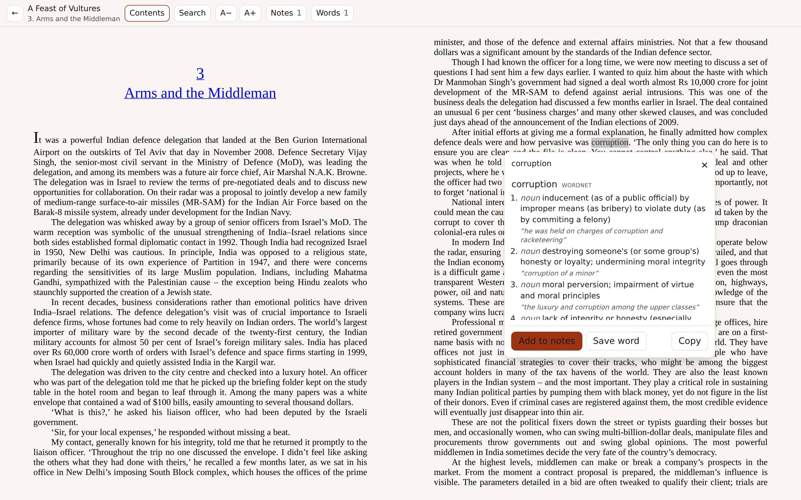
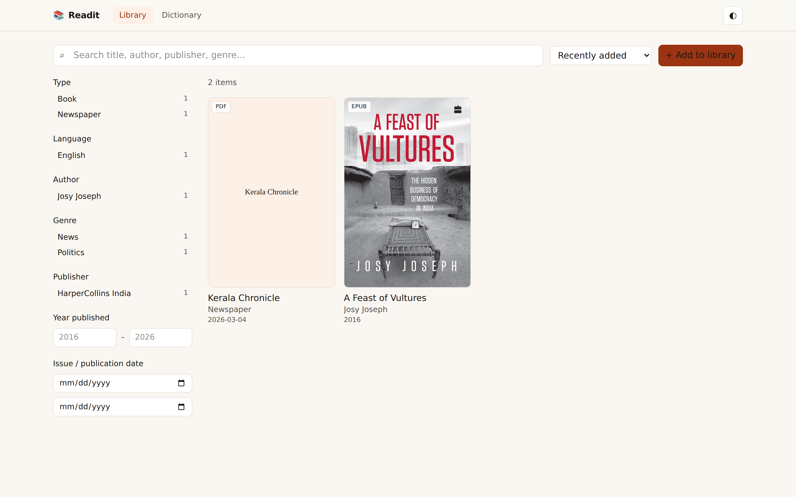
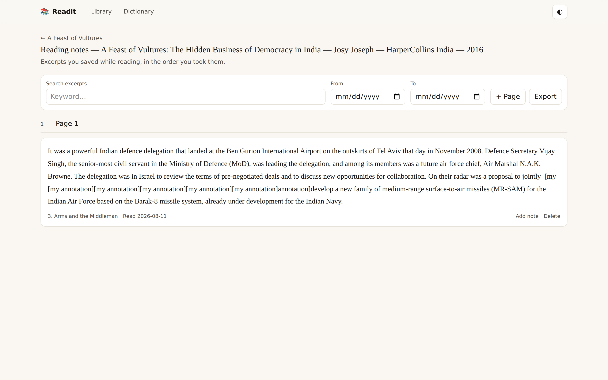
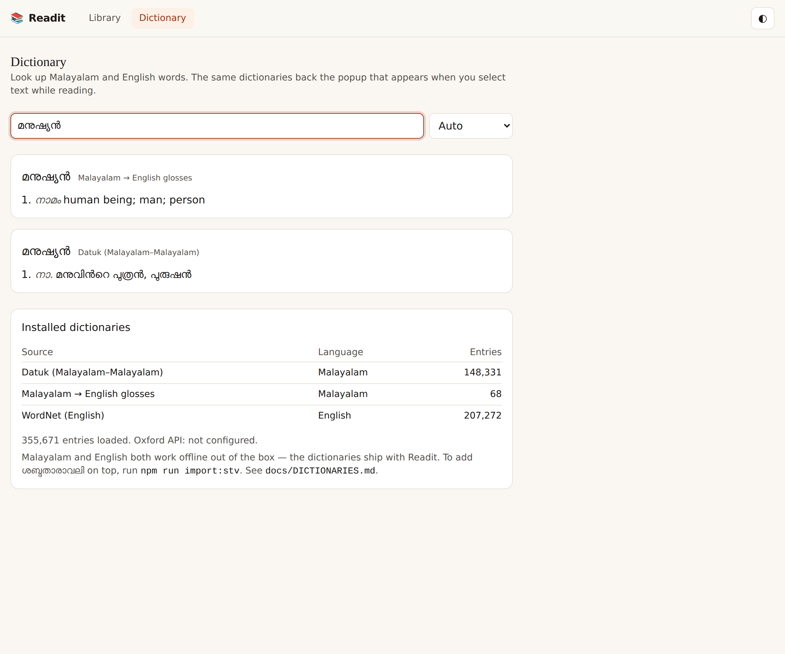

# Readit

[](https://github.com/robinfrancis186/readit/actions/workflows/ci.yml)

One searchable library for your books, magazines, newspapers and PDFs — with a
reader that turns any selection into a dictionary lookup or a note.

Readit runs on your own computer. No account, no subscription, no connection
needed. Your books never leave your machine: the library, the notebooks and the
dictionaries are one SQLite file and one folder that belong to you.



---

## Run it

Node 20 or newer.

```bash
git clone https://github.com/robinfrancis186/readit.git
cd readit
npm install
npm start          # open http://localhost:4000
```

That's the whole setup. `npm start` builds on the first run and afterwards only
when something changed, so day to day it just opens. Both dictionaries — 355,671
entries across Malayalam and English — load themselves on that first run.
Nothing is downloaded and there is no import step to remember.

Ctrl-C stops it. Nothing runs in the background when you aren't using it.

### On your phone

While the phone shares your Wi-Fi:

```bash
npm start -- --lan
```

It prints the address to type in — something like `http://192.168.1.42:4000`.
Add it to your home screen and it behaves like an app. On a network you don't
control, set a password first:

```bash
READIT_PASSWORD='a passphrase' npm start -- --lan
```

---

## How you actually use it

1. **Add a book.** Drag an EPUB or PDF onto *Add to library*. Readit reads the
   title, authors, language, publisher, date, ISBN and cover out of the file and
   indexes the full text. Correct anything it got wrong, and add edition, genres
   or an issue date.
2. **Read it.** EPUBs paginate with a table of contents; PDFs render with a real
   text layer, so the words are selectable rather than a picture. Font size and
   your place are remembered.
3. **Select a word.** Its meanings appear immediately, offline, in Malayalam or
   English.
4. **Keep what matters.** *Add to notes* files the passage in that book's
   reading notes, recording the chapter it came from. *Save word* files the word
   with the meanings you were shown.
5. **Find it again later.** Both notebooks are editable, searchable by keyword
   and by date range, and exportable to Markdown.



---

## What it does

**Collects and classifies.** Filter by type, language, author, genre, publisher,
series, year range and issue-date range, in any combination, with live counts on
every facet. Search titles and authors, or search *inside* a book and jump
straight to the passage.

**Two notebooks for every item**, created automatically and named with the
particulars of their source, so a notebook is identifiable on its own:

> Reading notes — A Feast of Vultures: The Hidden Business of Democracy in
> India — Josy Joseph — HarperCollins India — 2016

Both are laid out as books with numbered pages. Click into an excerpt and type.



**Periodicals are handled as periodicals.** A magazine or newspaper gets a
separate notebook page per issue date, so a title you follow over months reads
chronologically. Word lists page by the date you read them.

Looking the same word up twice in one sitting won't leave two identical entries
— Readit says it's already on today's page. Meeting it again on a later day
*does* record a second entry, because that's a genuine second sighting in a new
context. Excerpts are never de-duplicated: the same passage may be quoted twice
on purpose.

**Installs as an app.** Readit is a progressive web app — no app store:

| Platform | How |
| --- | --- |
| Windows / macOS / Linux | Chrome or Edge → the install icon in the address bar |
| Android | Chrome → menu → *Install app* |
| iOS / iPadOS | Safari → Share → *Add to Home Screen* |

Installed, it opens instantly and its shell still loads without a connection, so
you get a real explanation rather than a browser error page.

---

## Dictionaries

Two are bundled and load on first start. Nothing to download, no API key:

| Language | Dictionary | Contents | Size |
| --- | --- | --- | --- |
| Malayalam | **Datuk** | 148,331 definitions for 83,610 words | 2.6 MB |
| English | **WordNet 3.1** | 207,272 senses with examples | 4.2 MB |



Malayalam is agglutinative, so a word in running text is rarely the word in the
dictionary. Lookup strips case and postpositional suffixes to reach the
headword — select `ജനാധിപത്യത്തിന്റെ` and you get `ജനാധിപത്യം` — and restores the
anusvara or virama a suffix displaces. It also folds the two ways Malayalam
writes its chillu letters (ൺ ൻ ർ ൽ ൾ ൿ), so a word from a modern EPUB matches a
dictionary digitised the older way. Without that folding, 38% of the bundled
Malayalam vocabulary is unreachable.

Datuk explains a Malayalam word *in Malayalam*, so a few dozen Malayalam →
English glosses are bundled too, for when you want the English meaning. Every
source is labelled and results from all of them appear together.

Optional extras: ശബ്ദതാരാവലി via `npm run import:stv`, and Oxford as a live
provider with an API key. See [docs/DICTIONARIES.md](docs/DICTIONARIES.md) for
those, the licences, and how to add a dictionary of your own.

---

## Configuration

Everything you add lives in `data/` — `data/readit.db` plus the original files
under `data/library/`. Back up that one folder and you've backed up everything.

| Variable | Default | Purpose |
| --- | --- | --- |
| `PORT` | `4000` | HTTP port |
| `HOST` | `127.0.0.1` | Bind address. `0.0.0.0` exposes it to your network |
| `READIT_DATA_DIR` | `./data` | Database, imported files, covers |
| `READIT_PASSWORD` | – | Require a password. Essential on any public host |
| `READIT_SESSION_DAYS` | `30` | How long a sign-in lasts |
| `READIT_MAX_UPLOAD` | `536870912` | Upload size limit, in bytes |
| `OXFORD_APP_ID` / `OXFORD_APP_KEY` | – | Enables the Oxford provider |

### Do you need to host it anywhere?

Probably not. Hosting solves one problem: reaching the *same* library from a
device that isn't on your network. If that doesn't matter to you, stop here.

If it does, there's a `Dockerfile` and configs for Fly.io and Render;
[docs/DEPLOY.md](docs/DEPLOY.md) walks through it. Set `READIT_PASSWORD` before
exposing it to anything — Readit has no accounts, so without one anyone who
reaches the URL can read *and delete* your library.

There's also a [project page](https://robinfrancis186.github.io/readit/) on
GitHub Pages. That's a description of Readit, not the app — Pages serves static
files and Readit needs a server and a disk.

---

## Development

```bash
npm run dev        # web on :5173, API on :4000, with hot reload
npm run typecheck
```

### Tests

```bash
npm test                                          # unit tests
READIT_SAMPLE_EPUB=/path/to/book.epub npm test    # also exercises real EPUB ingestion

npm start                                         # in another terminal
READIT_SAMPLE_EPUB=/path/to/book.epub npm run test:e2e
```

Three end-to-end suites drive a real browser and fail on any console error:

- **Book** — import an EPUB, read it, select text, look a word up, save and edit
  notes, search and export them.
- **Periodical** — import a PDF newspaper with an issue date, read it through
  pdf.js's text layer, look up an English and a Malayalam word, and confirm
  excerpts are filed on a page of their own for that issue.
- **PWA** — the manifest, icons and iOS tags needed to install, and that the app
  boots offline rather than showing a blank page.

They need the built app being served (`npm start`), not the dev server. Set
`READIT_URL` to point them elsewhere and `CHROMIUM_PATH` to use a Chromium you
already have.

### How it is put together

```
server/   Fastify + SQLite (better-sqlite3). REST API, EPUB/PDF ingestion,
          dictionary engine and importers.
web/      React + Vite + Tailwind. Library, reader, notebooks, dictionary,
          plus the manifest and service worker that make it installable.
e2e/      Browser tests for the three end-to-end workflows.
site/     The static project page published to GitHub Pages.
```

Search everywhere — the library, inside a book, inside a notebook, and across
dictionary definitions — is SQLite FTS5 with Unicode tokenisation, so Malayalam
and English index and match on the same footing.

The API is deliberately separate from the UI. Everything the web app does goes
through `/api/*`, which is what a native desktop or mobile client would talk to
later; the browser app is simply the first client.

The data model, in four tables that matter:

- `items` — one row per physical thing: a book, a magazine issue, a newspaper
  issue, a loose PDF. Periodical fields stay null for books.
- `item_text` — extracted text, one row per EPUB spine entry or PDF page. This is
  what in-book search matches, and what lets an excerpt say where it came from.
- `documents` / `doc_pages` / `entries` — the notebooks, their pages, and the
  excerpts and words on them.
- `dict_entries` — the local dictionary store.

---

## Limits

Readit is single-user by design: one library, one optional password, no
accounts. Sharing the password shares everything, including deletion. On one
server with SQLite on one disk it suits one reader well, and does not survive
being scaled out.

Not built:

- **OCR.** A scanned PDF with no text layer will import and display, but its
  text can't be searched or selected, so no lookups and no excerpts from it.
- **Offline reading.** The installed app opens without a connection but needs
  the server for its contents.
- **Sync between devices.** There is one library on one machine that every
  device talks to.
- **Native applications.** Installing the PWA covers Windows, Android and iOS
  from one codebase; the separate API means native clients could be added
  without reworking the server.

On iOS, Safari evicts service worker caches for sites left unopened for a while,
so an installed copy may need a connection on its first launch after a gap.

---

## Licence and credits

Readit's own source is in this repository. The bundled dictionary data belongs
to its authors and keeps its own licence — **Datuk** under ODbL, **WordNet**
under the WordNet licence. See
[`server/data/dictionaries/ATTRIBUTION.md`](server/data/dictionaries/ATTRIBUTION.md).
